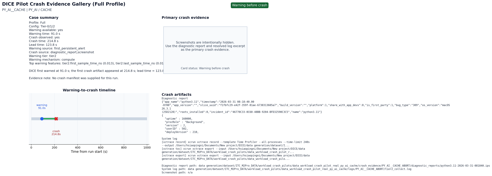
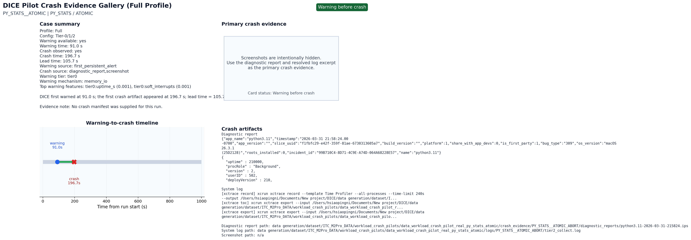
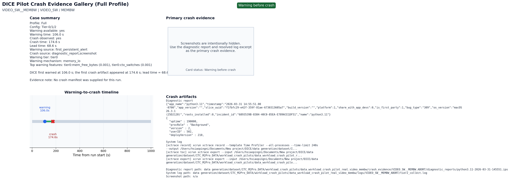

# DICE Pilot Crash Evidence Gallery (Full Profile)

This gallery summarizes the joined DICE warning-to-crash evidence available for each selected case.

## Card Index

| case_id | card_status_label | first_warning_s | crash_time_s | lead_time_s | crash_source |
| --- | --- | --- | --- | --- | --- |
| PY_AI__CACHE | Warning before crash | 91.0 s | 214.8 s | 123.8 s | diagnostic_report,screenshot |
| PY_STATS__ATOMIC | Warning before crash | 91.0 s | 196.7 s | 105.7 s | diagnostic_report,screenshot |
| BROWSER__BRANCH | Warning before crash | 91.0 s | 167.5 s | 76.5 s | diagnostic_report,screenshot |
| VIDEO_SW__MEMBW | Warning before crash | 106.0 s | 174.6 s | 68.6 s | diagnostic_report,screenshot |

## PY_AI__CACHE

- Status: Warning before crash
- Markdown card: `cards/PY_AI__CACHE.md`

## PY_STATS__ATOMIC

- Status: Warning before crash
- Markdown card: `cards/PY_STATS__ATOMIC.md`

## BROWSER__BRANCH

- Status: Warning before crash
- Markdown card: `cards/BROWSER__BRANCH.md`

## VIDEO_SW__MEMBW

- Status: Warning before crash
- Markdown card: `cards/VIDEO_SW__MEMBW.md`

