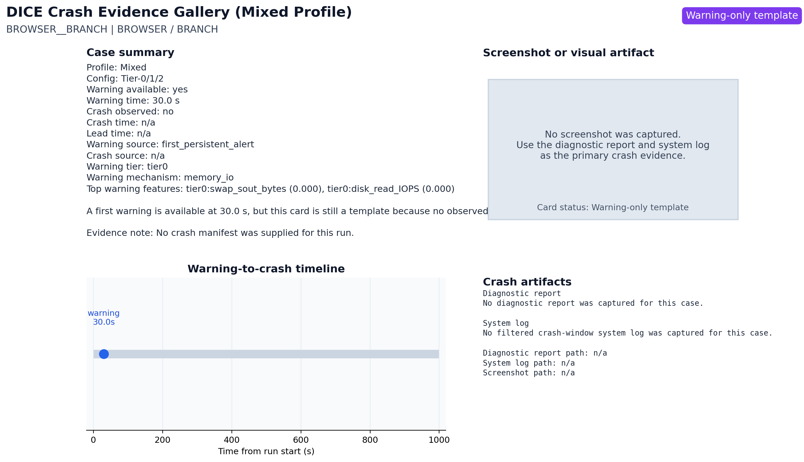
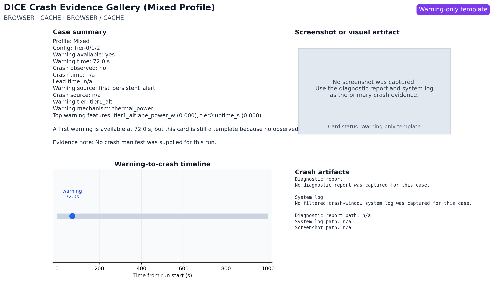
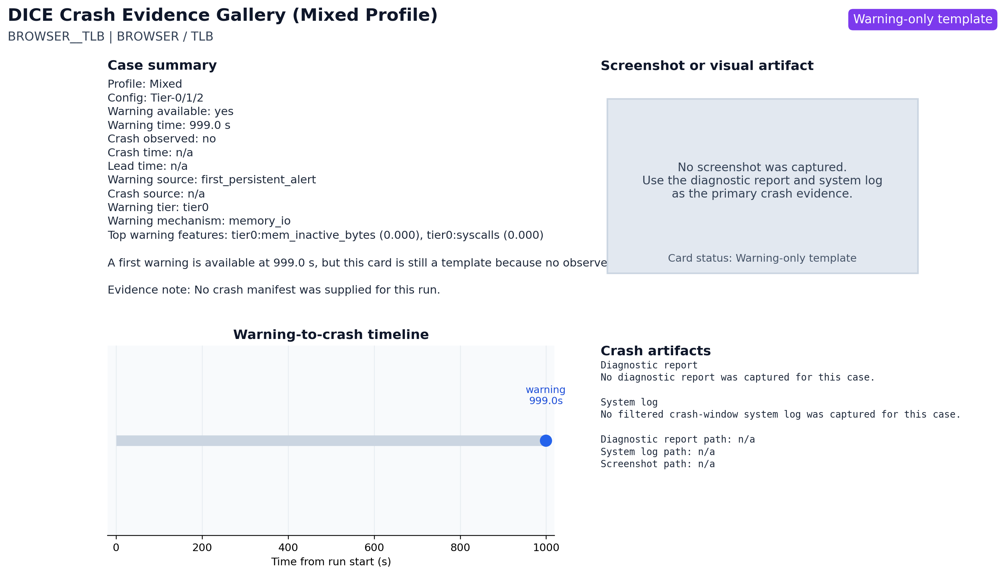
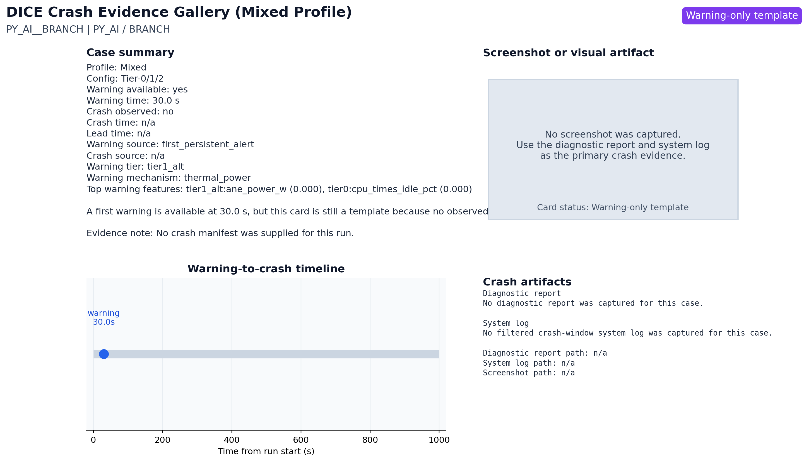

# DICE Crash Evidence Gallery (Mixed Profile)

This gallery summarizes the joined DICE warning-to-crash evidence available for each selected case.

## Card Index

| case_id | card_status_label | first_warning_s | crash_time_s | lead_time_s | crash_source |
| --- | --- | --- | --- | --- | --- |
| BROWSER__BRANCH | Warning-only template | 30.0 s | n/a | n/a |  |
| BROWSER__CACHE | Warning-only template | 72.0 s | n/a | n/a |  |
| BROWSER__MEMBW | Warning-only template | 30.0 s | n/a | n/a |  |
| BROWSER__TLB | Warning-only template | 999.0 s | n/a | n/a |  |
| PY_AI__ATOMIC | Warning-only template | 393.0 s | n/a | n/a |  |
| PY_AI__BRANCH | Warning-only template | 30.0 s | n/a | n/a |  |

## BROWSER__BRANCH

- Status: Warning-only template
- Markdown card: `cards/BROWSER__BRANCH.md`

## BROWSER__CACHE

- Status: Warning-only template
- Markdown card: `cards/BROWSER__CACHE.md`

## BROWSER__MEMBW

- Status: Warning-only template
- Markdown card: `cards/BROWSER__MEMBW.md`

## BROWSER__TLB

- Status: Warning-only template
- Markdown card: `cards/BROWSER__TLB.md`

## PY_AI__ATOMIC

- Status: Warning-only template
- Markdown card: `cards/PY_AI__ATOMIC.md`

## PY_AI__BRANCH

- Status: Warning-only template
- Markdown card: `cards/PY_AI__BRANCH.md`

