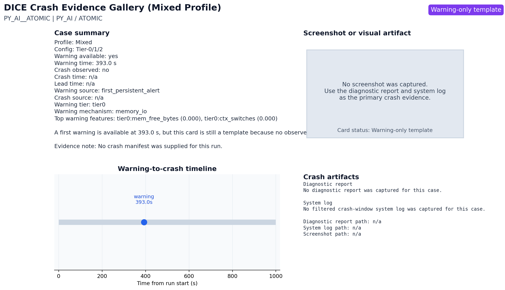

# Crash Evidence Card: PY_AI__ATOMIC



## Summary

- Status: Warning-only template
- Workload: PY_AI
- Stressor: ATOMIC
- Warning time: 393.0 s
- Crash time: n/a
- Lead time: n/a
- Warning source: first_persistent_alert
- Crash source: n/a

## Evidence Files

- Diagnostic report: `n/a`
- System log: `n/a`
- Screenshot: `n/a`

## Diagnostic Report Excerpt

```text
No diagnostic report was captured for this case.
```

## System Log Excerpt

```text
No filtered crash-window system log was captured for this case.
```

## Notes

No crash manifest was supplied for this run.
