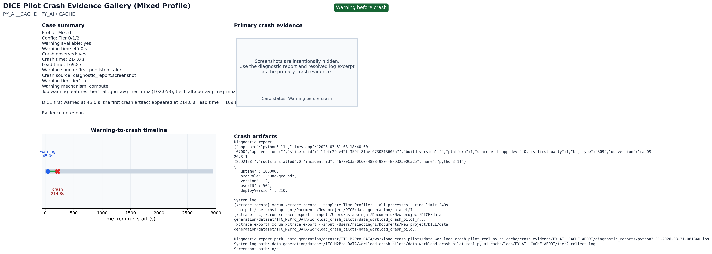

# Crash Evidence Card: PY_AI__CACHE



## Summary

- Status: Warning before crash
- Workload: PY_AI
- Stressor: CACHE
- Warning time: 45.0 s
- Crash time: 214.8 s
- Lead time: 169.8 s
- Warning source: first_persistent_alert
- Crash source: diagnostic_report,screenshot
- Log evidence used: raw pilot collection log

## Primary Crash Evidence

- Diagnostic report: `data generation/dataset/ITC_M2Pro_DATA/workload_crash_pilots/data_workload_crash_pilot_real_py_ai_cache/crash_evidence/PY_AI__CACHE_ABORT/diagnostic_reports/python3.11-2026-03-31-081840.ips`
- System / collection log: `data generation/dataset/ITC_M2Pro_DATA/workload_crash_pilots/data_workload_crash_pilot_real_py_ai_cache/logs/PY_AI__CACHE_ABORT/tier2_collect.log`

## Diagnostic Report Excerpt

```text
{"app_name":"python3.11","timestamp":"2026-03-31 08:18:40.00
-0700","app_version":"","slice_uuid":"f1fbfc29-e42f-359f-81ae-6730313605a7","build_version":"","platform":1,"share_with_app_devs":0,"is_first_party":1,"bug_type":"309","os_version":"macOS
26.3.1
(25D2128)","roots_installed":0,"incident_id":"46770C33-0C60-48BB-9204-BFD32590C3C5","name":"python3.11"}
{
  "uptime" : 160000,
  "procRole" : "Background",
  "version" : 2,
  "userID" : 502,
  "deployVersion" : 210,
```

## System / Collection Log Excerpt

```text
[xctrace record] xcrun xctrace record --template Time Profiler --all-processes --time-limit 240s
--output /Users/hsiaopingni/Documents/New project/DICE/data generation/dataset/I...
[xctrace toc] xcrun xctrace export --input /Users/hsiaopingni/Documents/New project/DICE/data
generation/dataset/ITC_M2Pro_DATA/workload_crash_pilots/data_workload_crash_pilot_r...
[xctrace export] xcrun xctrace export --input /Users/hsiaopingni/Documents/New project/DICE/data
generation/dataset/ITC_M2Pro_DATA/workload_crash_pilots/data_workload_crash_pilo...
```

## Notes

nan
